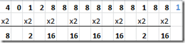
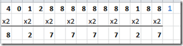
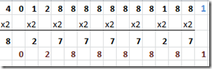
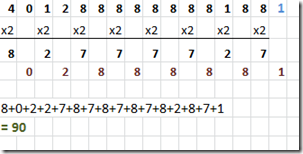
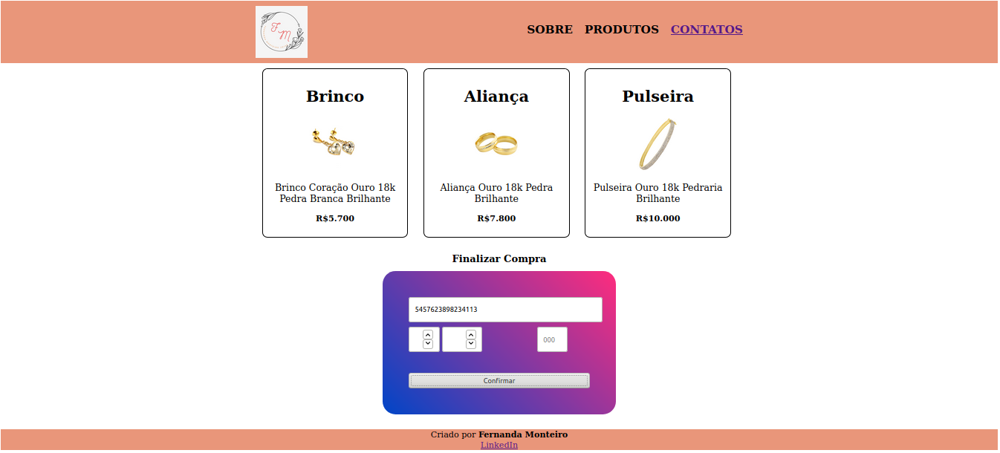
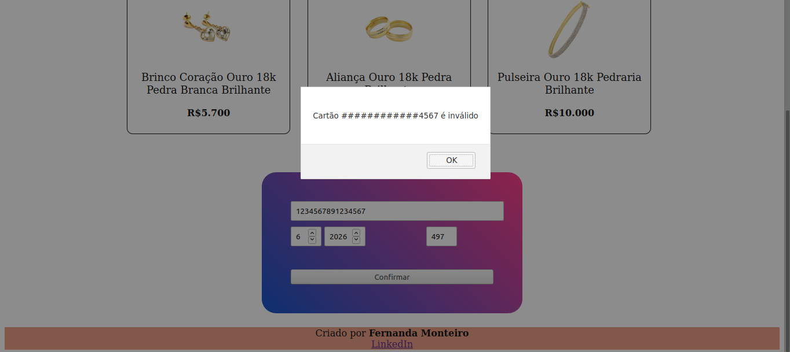
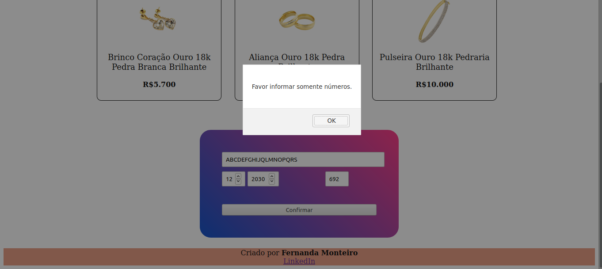

# Cartão de Crédito Válido

## 1. Introdução

A joalheria Fernanda Monteiro além de muitas novidades, também transforma seus sonhos em jóias e traz a oportunidade de você realizar suas compras em um ambiente seguro e no conforto de seu lar, dando a oportunidade de efetuar os pagamentos com o seu cartão de crédito de forma segura. Nosso E-commerce trás o que há de melhor para agilizar o seu processo de compra.
Para validar o seu cartão de crédito, utilizamos a análise através do Algoritmo de Luhn que é a forma como é mais conhecida, ou também como é chamado de módulo 10. O algoritmo de Luhn é um método de soma de verificação, que é usado para validar números de identificação, como o IMEI de telefones celulares, cartões de crédito
etc.
Fonte [Wikipedia](https://en.wikipedia.org/wiki/Luhn_algorithm).

Segue abaixo os passos para realizar essa validação:

<strong>1º</strong> Começando da direita para a esquerda, multiplique por dois cada digito par;

<strong>2º</strong> Caso a multiplicação dos dígitos resulte em um número com dois digitos, some os digitos para obter um número de apenas um dígito;

<strong>3º</strong> Agora adicione os digitos ímpares que não foram multiplicados, aos números pares que foram multiplicados;

<strong>4º</strong> Agora some todos os dígitos deste número, se a soma final for divisível por 10, o número do cartão de crédito é válido, se não for divisível por 10, o número do cartão é inválido.

## 2. Resumo do projeto

Nesse projeto quis mostrar como é feita a validação de um cartão de crédito. Devido a atual realidade, com a pândemia Covid-19 o número de compras pela internet cresceu de forma gigantesca, sendo assim, busquei trazer o usuário para dentro desse espaço de E-commerce e mostrar como funciona o Algoritmo de Luhn para validar seu cartão em suas compras online.

## 3. Design do Projeto

- O projeto foi todo planejado em busca de proporcionar ao usuário um ambiente agradável e seguro, trazendo o que há de melhor e mais luxuoso em jóias e acessórios.

## 4. Resultado final do projeto

<strong>Página Home do E-commerce Fernanda Monteiro Jóias</strong>

<strong>Página com a validação do cartão de crédito do E-commerce Fernanda Monteiro Jóias</strong>

<strong>Página com a não validação do cartão de crédito do E-commerce Fernanda Monteiro Jóias devido ao usuário ter inserido números incorretos.</strong>

<strong>Página com a não validação do cartão de crédito do E-commerce Fernanda Monteiro Jóias devido ao usuário ter inserido letras ao invés de números.</strong>

## 6. Tecnologias Utilizadas

- HTML5
- CSS3
- JavaScript Vanilla
- Git
- GitHub
- Node.js

## 9. Considerações Finais

Esse foi meu primeiro projeto no mundo da tecnologia, desejo daqui à algum tempo poder olhar com muito carinho pra ele e poder enxergar minha evolução.
Agradeço toda a equipe do Laboratótia, ao meu squad que foi o 5, e todas as colegas Laboratorians que contribuíram direta ou indiretamente para a realização de projeto.
Gratidão.